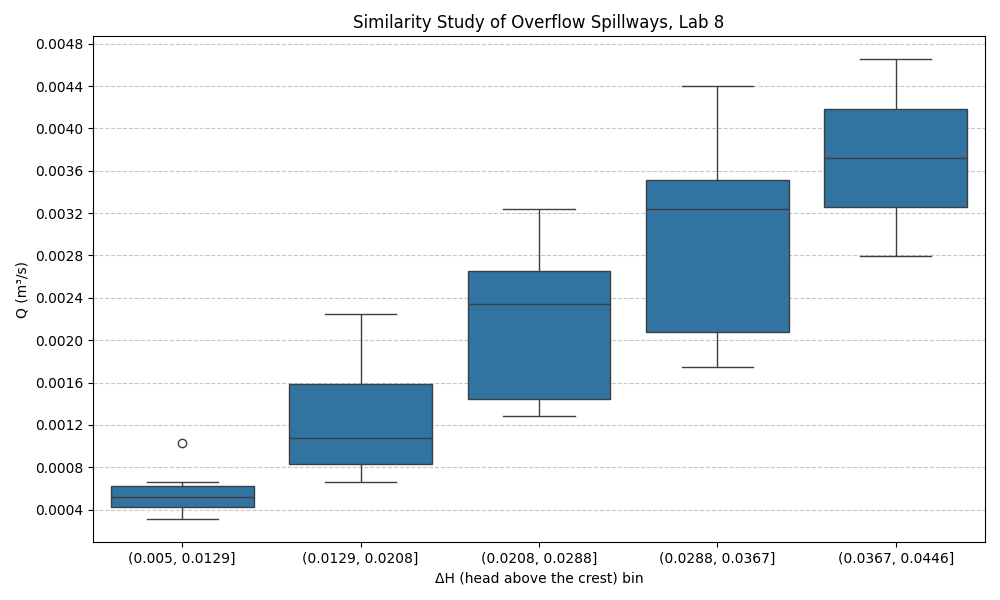
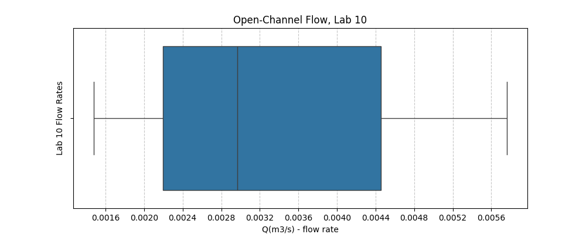

# UIUC TAM 335 Lab Data Analysis

This program works with data from past UIUC TAM 335 labs, specifically Lab 8 and Lab 10.

## Overview

**Lab 8: Similarity Study of Overflow Spillways**  
The main goal of this lab is to test dynamic similarity by comparing flow over geometrically similar spillways in a small flume.

**Lab 10: Open-Channel Flow**  
This lab focuses on open-channel flow in a rectangular flume. The whole point is to see how the water surface depth changes along the channel for a fixed slope and flow rate.

---

## Lab 8 Analysis



This figure shows how the measured flow rate (Q) changes as the head above the spillway crest (ΔH) increases in the “Similarity Study of Overflow Spillways” lab (lab 8). The data are grouped into ΔH ranges (bins) along the x-axis, and each boxplot summarizes the distribution of flow rates recorded within that head range.

---

## Lab 10 Analysis



This figure is a box-and-whisker plot showing the range of volumetric flow rates Q used across several runs of the Open-Channel Flow (Lab 10) experiment. The x-axis is the flow rate in m³/s, and each value represents the single constant discharge used during a full lab run (the same Q is held while the gate settings are changed to create different water-surface profiles).

---

## Max Flow Rate Calculation


The diagram above shows the configuration for Lab 10 with the max possible slope of the flume. The Bernoulli equation is applied to find the max possible flow rate in the flume without losses.

Using the data in `Max_Q_with_loss.py` and material properties of the flume, an estimate of the max flow rate using Bernoulli's extended equation notes the following results:

### Equations Solved

The script solves the following system of three equations for velocity ($v_2$), friction factor ($f$), and Reynolds number ($Re_D$):

**Hydraulic Diameter ($D_h$):**
   $$ D_h = \frac{4A}{P} = \frac{2HW}{H+W} $$

1. **Extended Bernoulli Equation (Energy Equation):**
   $$ (z_1 - z_2) - \frac{v_2^2}{2g} - f \frac{L}{D_h} \frac{v_2^2}{2g} = 0 $$

2. **Reynolds Number Definition:**
   $$ Re_D - \frac{\rho v_2 D_h}{\mu} = 0 $$

3. **Haaland Equation (Friction Factor):**
   $$ \frac{1}{\sqrt{f}} + 1.8 \log_{10} \left( \left( \frac{\epsilon/D_h}{3.7} \right)^{1.11} + \frac{6.9}{Re_D} \right) = 0 $$

### ==== Results ====
```text
v2 (m/s)   = 1.37621273608829
v2 (ft/s)  = 4.51513379306791

f          = 0.0150296841684291
Re_D       = 239217.544386167

Q (m^3/s)  = 0.0426181156231067
Q (ft^3/s) = 1.50504596779533
Q (GPM)    = 675.509918060928
```
